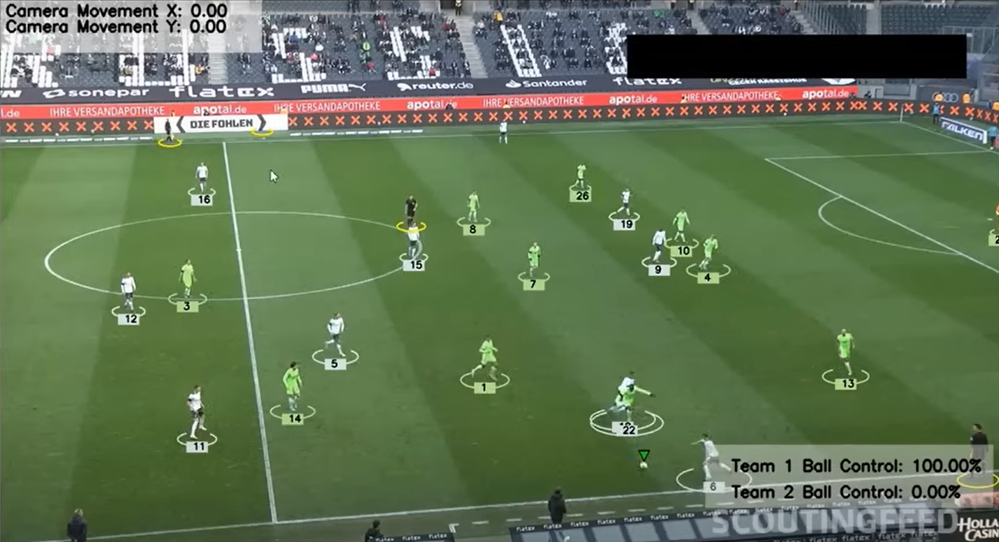

# Sports Analysis Project

## Introduction
The objective of this project is to use YOLO, a very advanced AI object identification model, to identify and monitor players, referees, and footballs in a video. Additionally, we will provide training to enhance the model's performance. Furthermore, we will assign players to teams by using Kmeans for pixel segmentation and clustering, taking into account the colours of their t-shirts. Using this data, we are able to calculate the proportion of times a team successfully acquires the ball throughout a match. In addition, we will use optical flow to quantify the displacement of the camera between consecutive frames, so allowing us to precisely assess the motion of a player. In addition, we will use perspective transformation to accurately depict the depth and perspective of the scene, enabling us to track a player's movement in metres instead of pixels. Ultimately, we will compute the velocity of a player and the total distance travelled. This project encompasses a range of principles and tackles practical issues, making it appropriate for individuals at all levels of expertise, including novices and seasoned machine learning experts.

### 1. Team Identification: 
By using K-means clustering for pixel segmentation, we will differentiate and assign players to their corresponding teams based on the hues of their respective jerseys. This allows for precise examination of KPIs that are particular to each team. 

### 2. Measurement of Ball Control: 
Through the monitoring of the football and the interactions between players and the ball, we will determine the percentages of ball possession for each side. This will provide valuable insights on the dynamics of the game and the performance of the teams. 
### 3. Analysis of Player Movement: 
By using optical flow methods, we will quantify the movement of the camera between consecutive frames. This enables us to precisely monitor the motions of players and make necessary adjustments for camera panning and zooming. 
By using perspective transformation, we may translate measurements based on pixels into distances in metres that correspond to real-world objects. This transformation takes into consideration the depth and perspective of the scene, providing a more authentic portrayal of player actions on the pitch.
### 4. Calculation of Speed and Distance:
We will determine the velocity of players and the overall distance they traverse during the match. This data is essential for evaluating player performance, endurance, and overall impact on the game.
### 5. Practical Relevance: 
This project tackles real-world issues in sports analytics, making it applicable to both academic research and practical uses in sports administration and coaching.

## Requirements
To run this project, you need to have the following requirements installed:
- Python 3.x
- ultralytics
- supervision
- OpenCV
- NumPy
- Matplotlib
- Pandas

## Modules Used
The following modules are used in this project:
- YOLO: AI object detection model
- Kmeans: Pixel segmentation and clustering to detect t-shirt color
- Optical Flow: Measure camera movement
- Perspective Transformation: Represent scene depth and perspective
- Speed and distance calculation per player
